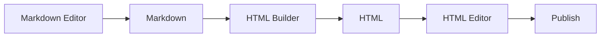

Markdown Editor -> Markdown -> HTML Builder -> HTML -> HTML Editor -> Publish

Or basically just an editor that can switch between Markdown and HTML modes like Publisher used to be able to. There are many WSIWYG editors on GitHub, like Jodit.

See: https://github.com/JefMari/awesome-wysiwyg-editors