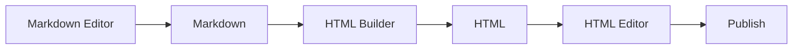

Markdown Editor -> Markdown -> HTML Builder -> HTML -> HTML Editor -> Publish




```mermaid
graph LR
A["Markdown Editor"] --> B["Markdown"] --> C["HTML Builder"]

---

graph TD
C --> D["HTML"]

graph RL
D --> E["HTML Editor"] --> F["Publish"]
```
