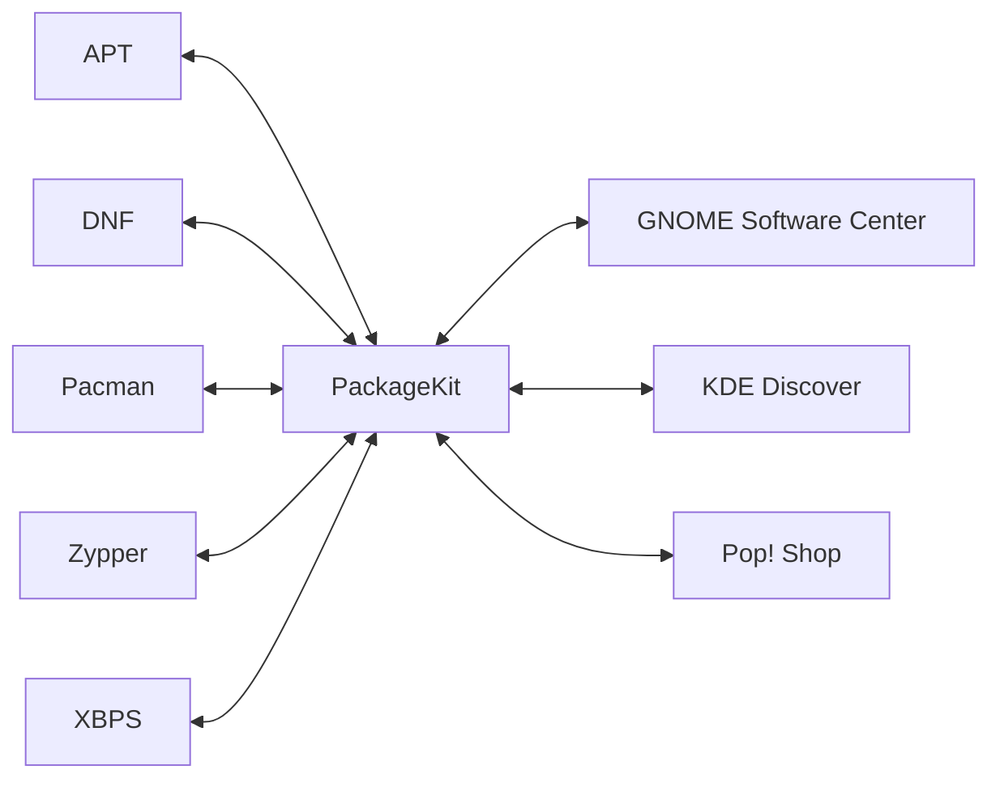

Say you have all these different package managers - APT, DNF, Pacman, Zypper, XBPS, etc. - and you want them to work with all these different GUIs - GNOME Software Center, KDE Discover, Pop! Shop, etc.

So what you do is, create a middleware abstraction layer that serves as a unified frontend for all package managers, and as a unified backend for all GUIs.

You'd then write PackageKit backends for each package manager and frontends for each GUI - that is, they'd serve as the backends and frontends to PackageKit with respect to the package managers and GUIs respectively.

