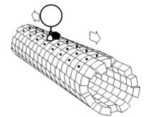

## Introduction
A window manager is the program that handles displaying the content of GUI applications. It also adds window decorations and the maximize, minimize and close buttons.

Window managers can be divided based on their style as: Tiling, Stacking and Dynamic.

There are two main displaying systems in UNIX-Like operating systems: [X WIndowing System](World%20Building/Science%20and%20Engineering/Mathematics/Computer%20Science/Operating%20Systems/UNIX%20and%20Linux/X%20WIndowing%20System.md) (or X) and the newer [Wayland](World%20Building/Science%20and%20Engineering/Mathematics/Computer%20Science/Operating%20Systems/UNIX%20and%20Linux/Wayland.md). For other operating systems, see [Windowing Systems](World%20Building/Science%20and%20Engineering/Mathematics/Computer%20Science/Operating%20Systems/UNIX%20and%20Linux/Windowing%20Systems.md).

In [X WIndowing System](World%20Building/Science%20and%20Engineering/Mathematics/Computer%20Science/Operating%20Systems/UNIX%20and%20Linux/X%20WIndowing%20System.md):
Display Server > [Compositor](Compositors.md) > Window Manager

Compositing Window Mangers are Window Managers with an integrated compositor.
A desktop environment shell has a window manager, compositor and other panels, docks and widgets running on an X display server.

In [Wayland](World%20Building/Science%20and%20Engineering/Mathematics/Computer%20Science/Operating%20Systems/UNIX%20and%20Linux/Wayland.md):
Wayland takes a combined approach to the display ecosystem.

The display server, window manager and compositor are a single program, called a compositor.
A desktop environment shell has a compositor and and other panels, docks and widgets.

## Components
### Dash (/ App Menu / Launcher)

| Windows 8 Start Menu | Android Launcher (Pixel) | GNOME Dash (Mine, with Blur My Shell extension) | MacOS Launchpad  | Deepin 15.11 Dash |
| -------------------- | ------------------------ | ----------------------------------------------- | ---------------- | ----------------- |
|      |          |                                 |  |   |

### Dock (/ Panel / Task bar)
They are conventionally placed at the bottom or at the left.
I used horizontal screenshots to show them without having to scroll too much.

#### Examples

| OS                              | Screenshot       |
| ------------------------------- | ---------------- |
| Windows 7 Taskbar               |  |
| GNOME Dash to Dock (Dock Mode)  |  |
| GNOME Dash to Dock (Panel Mode) |  |
| GNOME Dash to Panel             |  |
| Plank Dock (app)                |  |
| Pantheon Dock                   |  |

Here are some vertical screenshots, anyway:

| Windows 10       | Ubuntu Dock      | GNOME Dash to Dock (Dock Mode) | GNOME Dash to Dock (Panel Mode) | GNOME Dash to Panel |
| ---------------- | ---------------- | ------------------------------ | ------------------------------- | ------------------- |
|  |  |                |                 |     |

### Bar (/ Panel / Status bar)
They are conventionally placed at the top. Some window managers include a bar with them.

#### Examples
- Polybar
- Wibar (Awesome)
- dwm bar + dwmblocks
- somebar (dwm bar for dwl) + someblocks (dwmblocks for dwl)
#### Bar Widgets
Date, Time, Bluetooth, Wi-Fi, Sound, Night Colour, etc.
Spotify, Calendar
Workspace Indicator
Open Windows, etc. according to your preference.

Full List: Workspace Indicator, Task View, Date and Time, Bluetooth, Calendar, Notifications, System Tray
### Desktop Widgets
You really have to get imaginative here. In Windows, we use Rainmeter for this.
There are many widgets made using eww (El Kowar's Wacky Widgets).

## Examples of Window Managers
A larger list can be found in the [Arch Wiki > Window Managers](https://wiki.archlinux.org/title/window_manager)

### X based

#### Stacking / Floating
- Compiz (A Window Manager with 3D effects)
- Metacity (Older, uses XRender instead of OpenGL)
- Mutter (Used in GNOME and Cinnamon)
- KWin (KDE Window Manager)
- Xfwm (Xfce Window Manager)
- Enlightenment
- fluxbox
- twm (Default window manager used by X.org server)
- Window Maker (neXTSTEP style)
- AfterSTEP (neXTSTEP style)
- IceWM
- openbox

#### Tiling
- i3
- i3-gaps (i3-fork that allows gaps between tiled windows; now joined with i3)
- Regolith (i3 with GNOME shell)
- bspwm
- ratpoison (Say goodbye to your mouse ***my tubelight self realizes pun***)
- herbstluftwm (Pronounce as herbs-laugh-t XD)

#### Dynamic
- dwm (Suckless Software)
- awesome (dwm fork)
- spectrwm
- xmonad
- Qtile

## Wayland compositors
Since in Wayland, window managers and compositors are combined, they are just called compositors.

- dwl (dwm clone for Wayland)
- Hyprland
- sway
- river
- cage
- cagebreak
- waymonad (xmonad clone for Wayland)
- Mutter (used in GNOME)
- KWin (KDE window manager)
- Enlightenment
- wlroots (A base library for building Wayland compositors)
- Weston (Wayland demo compositor)

| Windows 8 Start | Stock Android Launcher (Pixel)  | GNOME Dash (Mine, with Blur My Shell extension)  | MacOS Launchpad   | Deepin 15.11 Dash   |
| ----------------| ------------ | ----------------- | --------------- | ------------- |
|  |  |  |  |  |